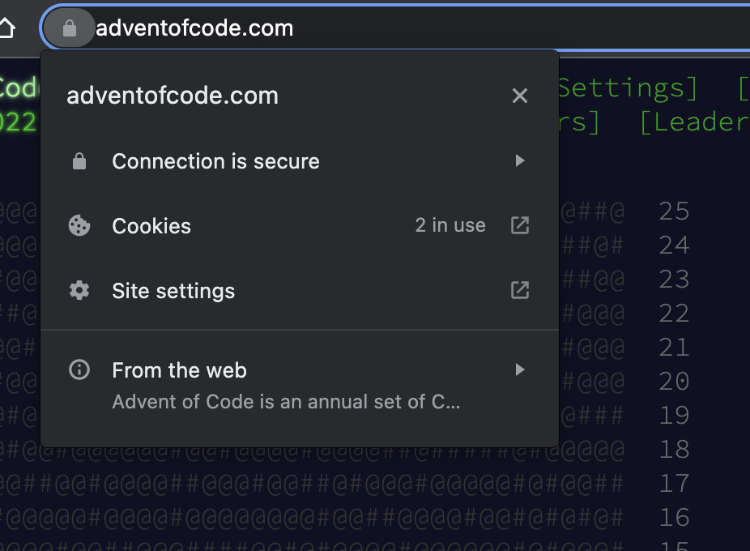
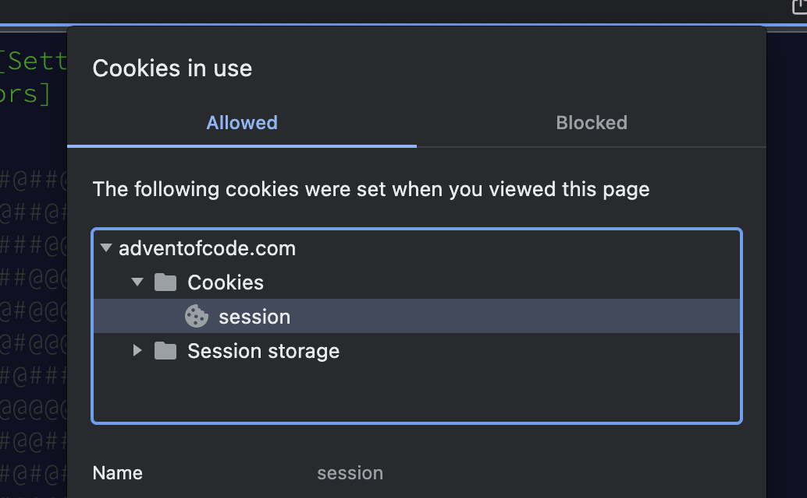

# AOC - Get Session Token
In order to pull your unique puzzle input each day, `aoc` needs access to your session token for AdventOfCode. This session token is available in your cookies on your web browser.

## Accessing the Token
> *These Documents assume you're using Google Chrome*

1. Navigate to the [Advent of Code](https://adventofcode.com) homepage
1. Ensure you are logged in to the page
1. Click on the lock next to the site address in your address bar
   
1. Click on "Cookies"
1. Expand the "adventofcode.com" and "cookies" sections to access the `session` cookie.
   
1. Copy the contents of this cookie. This is your session token. It should be valid for the entire duration of the Advent of Code.

## Setting the Session Variable

There are two methods of passing the session token to `aoc`.

### Set the `AOC_SESSION` environment variable *(Recommended)*

The simplest way of setting the session token is to set the `AOC_SESSION` environment variable equal to your token. This is the recommended method. 
```
export AOC_SESSION=cafef00d1111111111111111
```

This can be added to your terminal's profile to simplify using the tool each time.

### Pass in the --session flag
When running `aoc` you can instead pass in the `--session` flag. This flag's value defaults to the `AOC_SESSION` environment variable. An example of using this flag would be:
```
aoc get 1 --session cafef00d1111111111111111
```